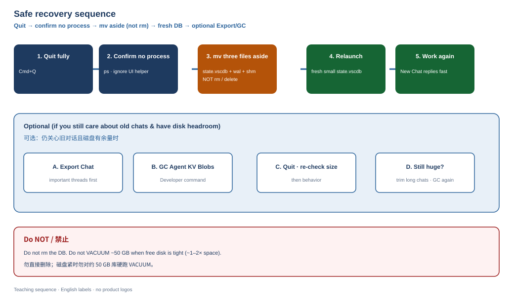

# How to: diagnose and recover (safely)

> **Door:** How to · **Use when:** you need size checks, emergency recovery, or a safe GC order.  
> **Not this page:** why symptoms look like the network → [01-principles.md](01-principles.md). Full story → [CASE_STUDY.md](CASE_STUDY.md).

Full story: [CASE_STUDY.md](CASE_STUDY.md). Commands only here.

Command cheat sheet (same idea, longer list): [DIAGNOSTIC_COMMANDS.md](DIAGNOSTIC_COMMANDS.md).

## 0. Quit the IDE first (for moves / GC / VACUUM)

```bash
# Cmd+Q in the UI, then:
ps aux | grep -i "[C]ursor"
```

Ignore macOS `CursorUIViewService`. No Cursor IDE / Electron workers should remain.

## 1. Read-only diagnose

```bash
cd /path/to/cursor-state-vscdb   # clone root
./scripts/diagnose.sh           # macOS default; Linux: CURSOR_STATE_DB=... ./scripts/diagnose.sh
# or:
du -h "$HOME/Library/Application Support/Cursor/User/globalStorage/state.vscdb"
sqlite3 "$HOME/Library/Application Support/Cursor/User/globalStorage/state.vscdb" \
  "SELECT COUNT(*) FROM cursorDiskKV;"
sqlite3 "$HOME/Library/Application Support/Cursor/User/globalStorage/state.vscdb" \
  "PRAGMA page_size; PRAGMA page_count; PRAGMA freelist_count;"
```

Rough thresholds (heuristic, not official):

| `state.vscdb` | Action |
|---------------|--------|
| &lt; 2 GB | Monitor |
| 2–10 GB | Export important chats; consider GC; avoid endless single chats |
| 10–30 GB | Plan cleanup soon; free disk before compact |
| &gt; 30 GB | Treat as incident; prefer move-aside recovery if IDE is unusable |

*Figure (TBD):* [figures/charts/size-compare/](../figures/charts/size-compare/) — case illustration of DB vs transcript sizes.

## 2. Emergency: work again now (`mv`, never `rm`)

STOP: Quit Cursor first. This moves `state.vscdb` aside (never `rm`) so a fresh DB can start.

```bash
cd "$HOME/Library/Application Support/Cursor/User/globalStorage"
BACKUP="state-vscdb-backup-$(date +%Y%m%d)"
mkdir -p "$BACKUP"
for f in state.vscdb state.vscdb-shm state.vscdb-wal; do
  [ -e "$f" ] && mv "$f" "$BACKUP"/
done
```

Relaunch Cursor → new DB → New Chat → `hello`. Keep the backup until you decide you no longer need it.

**Figure — recovery flow**



[Source folder](../figures/schematic/recovery-flow/)

## 3. Prefer keeping history

```text
Quit → confirm agent-transcripts exist
  → Export Chat for anything precious
  → Command Palette: Developer: GC Agent KV Blobs
  → Quit again → re-run diagnose.sh
```

If still huge: export → delete a few monster long chats → GC → quit. Prefer that over raw SQL `DELETE` + `VACUUM`.

## 4. Do not start here

STOP: Do not run this first — users report chat loss; only after backup and an explicit impact discussion.

```sql
DELETE FROM cursorDiskKV WHERE key LIKE 'agentKv:%';
-- ...
VACUUM;
```

Do this only after an explicit impact discussion and a backup.

## 5. Free disk before compact

Need roughly DB-sized free space (plan for up to ~2×). If compact hits Disk Full mid-way, you can worsen the outage.

## 6. Redact secrets

`ps` lines may contain `--api-key`. Never paste raw process lists to GitHub / Reddit / forums.
